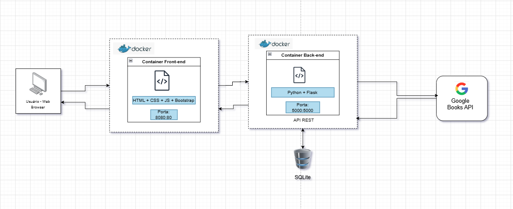

# Título: Estante Virtual

Frontend da aplicação **Estante Virtual**, desenvolvido para a disciplina *Arquitetura de Software*. Esta interface permite ao usuário **cadastrar, visualizar, editar e remover livros** da sua estante pessoal, com **auto-preenchimento via busca no Google Books**, além de acompanhar **estatísticas de leitura** por meio de gráficos.

## Arquitetura



---

## Tecnologias utilizadas   
- **HTML5** — estrutura semântica da aplicação
- **CSS3** — estilização personalizada da interface
- **JavaScript** — lógica da aplicação, navegação entre telas e comunicação com a API
- **Bootstrap** — framework de estilo base (via CDN)
- **Bootstrap Icons** — ícones utilizados nos botões e status (via CDN)
- **Google Fonts** - tipografia da interface
- **Chart.js** — geração dos gráficos de estatísticas (via CDN)
- **localStorage** — armazenamento local para funcionamento offline
- **Google Books API** — consumida pelo backend, usada para busca e auto-preenchimento do formulário de cadastro

---

## Pré-requisitos

Por ser uma aplicação web estática, o frontend **não requer instalação de dependências** — todas as bibliotecas externas (Bootstrap, Bootstrap Icons, Chart.js e as fontes) são carregadas via CDN diretamente no `index.html`.

Você precisará de:

- Um navegador
- *Observação:* O backend da Estante Virtual em execução em `http://localhost:5000` para persistência dos dados no banco e para o auto-preenchimento via Google Books (consulte o README do backend para instruções)

---

## Instalação e configuração do ambiente

### 1. Clone o repositório

```bash
git clone <url-do-repositorio>
cd <nome-da-pasta-do-projeto>
```

### 2. Verifique a estrutura de arquivos

O frontend fica na pasta `app_front/`, na raiz do projeto (ao lado de `app_api/`):
## Instalação e configuração do ambiente

### 1. Clone o repositório

```bash
git clone <url-do-repositorio>
cd <nome-da-pasta-do-projeto>
```

### 2. Verifique a estrutura de arquivos

O frontend fica na pasta `app_front/`, na raiz do projeto (ao lado de `app_api/`):
```
├── app_api/ # Backend (Flask)
└── app_front/
├── index.html # Estrutura e telas da aplicação
├── app.js # Lógica, navegação e comunicação com a API
├── style.css # Estilos personalizados da interface
├── Dockerfile # Imagem do front-end (Nginx)
└── README.md # Este arquivo
```

---

## Como executar o projeto

### Opção 1 — Direto no navegador (sem Docker)

Basta abrir o arquivo `app_front/index.html` diretamente no navegador com **duplo clique**. Nenhum servidor, extensão ou configuração adicional é necessária.

### Opção 2 — Via Docker

├── app_api/ # Backend (Flask)
└── app_front/
├── index.html # Estrutura e telas da aplicação
├── app.js # Lógica, navegação e comunicação com a API
├── style.css # Estilos personalizados da interface
├── Dockerfile # Imagem do front-end (Nginx)
└── README.md # Este arquivo


---

## Como executar o projeto

### Opção 1 — Direto no navegador (sem Docker)

Basta abrir o arquivo `app_front/index.html` diretamente no navegador com **duplo clique**. Nenhum servidor, extensão ou configuração adicional é necessária.

### Opção 2 — Via Docker

Com o [Docker Desktop](https://www.docker.com/products/docker-desktop/) instalado e em execução, na raiz do projeto:

```bash
# Cria a rede compartilhada com o backend (executar uma única vez)
docker network create estante-network

# Builda a imagem do front-end
docker build -t estante-frontend ./app_front

# Roda o container
docker run -d --name frontend --network estante-network -p 8080:80 estante-frontend
```

Acesse em `http://localhost:8080`.

> Para o auto-preenchimento e a persistência de dados funcionarem, o backend também precisa estar rodando — via Docker ou diretamente com `flask run` (consulte o README do backend).

---

## Modos de funcionamento

### Modo online (com backend)

Com o backend disponível em `http://localhost:5000`, todas as funcionalidades operam normalmente: persistência em banco de dados, estatísticas em tempo real e busca de livros no Google Books para auto-preenchimento do formulário.

### Modo offline (sem backend)

Caso o backend não responda em até 2,5 segundos, o frontend assume automaticamente o modo offline, usando o `localStorage` do navegador para cadastrar, editar, apagar livros e calcular as estatísticas.

**Nesse modo, o auto-preenchimento via Google Books não fica disponível** (depende do backend como intermediário) — o cadastro continua funcionando normalmente, só que de forma manual.

> ⚠️ Os dados cadastrados em modo offline ficam armazenados apenas no navegador e não são sincronizados automaticamente com o banco de dados ao ligar o backend.

---

## Funcionalidades

- **Estante (listagem):** exibe todos os livros cadastrados em cards, com capa (quando disponível)
- **Filtros:** permite filtrar os livros por status de leitura — *Todos*, *Lendo*, *Concluído* e *Quero ler*
- **Busca e auto-preenchimento (Google Books):** ao digitar o título, sugestões de livros aparecem com título, autor e capa; ao selecionar uma, o formulário é preenchido automaticamente
- **Cadastro:** formulário dinâmico que exibe campos condicionais conforme o status selecionado (ex: data de início para "Estou lendo", nota em estrelas para "Concluído")
- **Edição:** pré-preenchimento do formulário com os dados do livro selecionado, permitindo substituição completa dos dados
- **Remoção:** exclusão de livros com confirmação do usuário
- **Estatísticas:** três gráficos interativos — distribuição de livros por status (pizza), livros concluídos por mês (linha) e páginas lidas por mês (barras)

---

## Integração com o backend

O frontend consome as seguintes rotas da API:

| Método | Rota | Uso no frontend |
|---|---|---|
| `GET` | `/listarlivros` | Carrega a lista de livros na estante |
| `GET` | `/buscarlivrogoogle?titulo={titulo}` | Busca sugestões de livros no Google Books para o autocomplete |
| `POST` | `/cadastrarlivro` | Salva um novo livro |
| `PUT` | `/atualizarlivro?id={id}` | Substitui todos os dados de um livro existente |
| `DELETE` | `/deletarlivro?id={id}` | Remove um livro da estante |
| `GET` | `/estatisticas/livros-por-status` | Dados do gráfico de pizza (status) |
| `GET` | `/estatisticas/livros-concluidos-por-mes` | Dados do gráfico de livros concluídos por mês |
| `GET` | `/estatisticas/paginas-lidas-por-mes` | Dados do gráfico de páginas lidas por mês |
